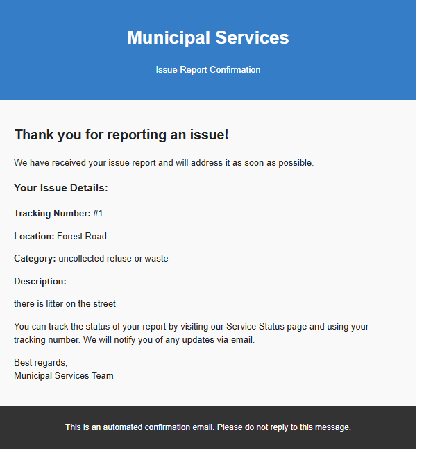

# Programming 7312 Part-1, Part-2 & POE Final Submission
# C# MVC Project Setup Guide

## Table of Contents
1. [Project Overview](#project-overview)
2. [Prerequisites](#prerequisites)
3. [Downloading the Project](#downloading-the-project)
4. [Extracting the Project Files](#extracting-the-project-files)
5. [Running the Project](#running-the-project)

---

## Project Overview
This is a C# ASP.NET MVC web application designed for Prog 7312 Part 1, 2 and POE Final Submission .

---

## Prerequisites
Ensure your system meets these requirements and has the following installed:
1. **Operating System**: Windows 10/11 or macOS/Linux
2. **.NET SDK**: Version 6.0 or later ([Download .NET](https://dotnet.microsoft.com/download))
3. **IDE** (Recommended):
   - Visual Studio 2022 
   - Any preferred IDE capable of running MVC projects 
4. **Web Browser**: Chrome

---

## Downloading the Project
### Step-by-Step Instructions:
1. **Navigate to GitHub Repository**:

https://github.com/Kashvir-Sewpersad/PROG7312_POE_ST10257503.git
   
    Locate ZIP file in Downloads folder
   
    Right-click the ZIP file
    
    Select "Extract All"
    
    Choose destination (e.g., C:\Projects\). I recommend a desktop folder 
    
    Click "Extract"
   ---
   ## Running the Project
   
    Open Visual Studio or IDE of your choice 
   
    Select "Open a project or solution"

Navigate to extracted folder and open
---

### Restore NuGet Packages:

    Right-click solution → "Restore NuGet Packages"
---------------------------

# Programming 7312 Part-2
# C# MVC Project Setup Guide

## Table of Contents
1. [Project Overview]
2. [Prerequisites]
3. [Downloading the Project]
4. [Extracting the Project Files]
5. [Running the Project]

---

## Project Overview
This is a C# ASP.NET MVC web application designed forProg 7312 Part 2 as per the POE requirements with a few additions  .

---

## Prerequisites
    Ensure your system meets these requirements:
    1. Operating System**: Windows 10/11 
    2.NET SDK**: Version 6.0 
    3. IDE :
          - Visual Studio 2022 (Community Edition free)
          - Rider 
    4. Web Browser: Chrome is preferred 

---

## Downloading the Project
### Follow These Instructions:
1. **Navigate to GitHub Repository**:
   - Copy the link under the code tag
   - Open your IDE of choice and clone the repo with the link
   
   Alternatively download the zip file 
    - Locate ZIP file in Downloads folder
   
   -  Right-click the ZIP file
    
    - Select "Extract All..."
    
    - Choose destination (e.g., C:\Projects\) -> I recommend desktop 
    
    Click "Extract all"
   ---
   ## Running the Project
   
   Open your IDE
   
Select "Open a project or solution"

Navigate to extracted folder and open
---

### Restore NuGet Packages:

Right-click solution → "Restore NuGet Packages"
---

### Set Startup Project:

In Solution Explorer, right-click web project
Select "Set as Startup Project"

### Press Build and Run
---

### This project makes use of SQlite database, the configuration is done in appsettings.json
### There is an automatic email responder api added to the code. the details shall removed for security reasons 
### To access and use the admin dashboard, use the hardcoded password ----- > 1234
### youtube link : https://youtu.be/7nXOtbyj1Ks

*************************************************

# Programming 7312 POE- FINAL SUBMISSION 
# C# MVC Project Setup Guide

## Table of Contents
1. [Project Overview]
2. [Prerequisites]
3. [Downloading the Project]
4. [Extracting the Project Files]
5. [Running the Project]

---

## Project Overview
This is a C# ASP.NET MVC web application designed for Prog 7312 POE -Final Submission  as per the POE requirements with a few additions  .

---

## Prerequisites
    Ensure your system meets the following requirements:
    1. Operating System**: Windows 10/11 
    2.NET SDK: Version 6.0 
    3. IDE :
          - Visual Studio 2022 
          - Rider 
    4. Web Browser: Chrome is preferred 

---

## Downloading the Project
### Follow These Instructions:
    1. Navigate to GitHub Repository:
         Copy the link under the code tag
         Open your IDE of choice and clone the repo with the link
    
       Alternatively download the zip file
         Locate ZIP file in Downloads folder
          Right-click the ZIP file
         Select "Extract All"
         Choose destination (e.g., C:\Projects\) -> I recommend desktop

   Click "Extract all"
   ---
   ## Running the Project

    Open your IDE
    
    Select "Open a project or solution"

Navigate to extracted folder and open
---

### Restore NuGet Packages:

Right-click solution → "Restore NuGet Packages"
---

### Set Startup Project:

    In Solution Explorer, right-click web project
    Select "Set as Startup Project"

### Press Build and Run
---

### This project makes use of SQlite database, the configuration is done in appsettings.json
### There is an automatic email responder api added to the code which activates when aa user makes use of the contact form.
### To access and use the admin dashboard, use the hardcoded password ----- > 1234
### YouTube link as proof of functionality (POE)  : https://youtu.be/RJtLioPy0R0
### GitHub link (CURRENT POE before transfer) : https://github.com/Kashvir-Sewpersad/PROG7312_POE_ST10257503.git

### I have implemented a system which send the tracking number via email to the user after filling out a service request or reporting an issue. 

### Data stuctures & Algorythms used 

### IssueStorage.cs (IssueStorage)
       BinarySearchTree<Issue> BstById: Organizes issues by ID for retrieval
       AVLTree<Issue> AvlByDate: Self-balancing tree for date-based sorting, ensuring insertions
       SortedSet<Issue> RedBlackByCategory: Red-Black tree for category-based sorting and filters
       PriorityQueue<Issue> HeapByPriority: Max-heap  for prioritizing issues by community votes
       ServiceRequestGraph Graph: Adjacency list graph for modeling issue dependency,  BFS traversal and MST
       GetMinimumSpanningTree:  algorithm implementation to find the minimum cost dependency network, optimiizing resource allocation for issues

### EventService.cs (EventService)
    SortedDictionary<DateTime, HashSet<Event>> EventsByDate: Organizes the events by date for  date lookup
    Dictionary<string, LinkedList<Event>> EventsByCategory: Group events by category using linked lists for ordered storage 
    HashSet<string> UniqueCategories: Stores unique category names for the dropdown
    HashSet<string> UniqueTags: Stores unique tag  for event tagging and suggestion
    Queue<Event> RecentEvents: FIFO -first in first out-  queue for tracking the most recent events - limited to  5 event 
    Stack<Event> FeaturedEvents: LIFO- last in first out- stack for featured events - limited to 3
    SortedDictionary<DateTime, HashSet<Event>> UpcomingEvents: Prioritizes upcoming events by date
    Dictionary<string, int> SearchHistory: Tracks search terms and how often for recommendations

### AnnouncementService.cs (AnnouncementService)
    Queue<Announcement> AnnouncementQueue: FIFO – first inn first out -  queue for managing announcements limited to  a maximum of 10
    Dictionary<string, List<Announcement>> AnnouncementsByCategory: Group the announcements 
    HashSet<string> UniqueCategories: Stores unique announcement category 
    SortedDictionary  List<Announcement>> AnnouncementsByPriority: Organize  announcements by priority level - high priority first  

### IssueStorage.cs (IssueStorage)
    LinkedList<Issue> ReportedIssues: Stores all the  report issues in a linked list for fast access and upvoting

### Event.cs
    List<string> Tags: Simple list for storing the many event tags

### Additional Notes
        my  project heavily uses advanced data structures to meet the POE demands  such as queues  stacks  dictionaries of many types  hash sets and linked lists
        SQLite is used for persistence, but in-memory data structures handle runtime operations.
        seeded data is added for the first start up then as admin and users perform actions, that data is sent to back end and then to the SQLite
        I have tried to maintain good coding practices throughout the development cycle 

    This program makes use of functional API calls. when a user submits via the contact form or reports an issue, a confromation email is sent to their gmail inbox. 
    For the report issue feature, the confirmation email shall contain the traccking number which can be used to follow up on the progress via the search bar located on the "Service Status" page 

///////////// REFEREMCES USED FOR THIS PROJECT /////////////

 
* Brevo.com. (2025). Brevo | Email Marketing Software, Automation & CRM. [online] Available at: https://www.brevo.com/?gad_source=1&gad_campaignid=23086271243&gbraid=0AAAAAp4YiPJM7xOPrXsppAUZnGIAu-LvQ&gclid=Cj0KCQjw6bfHBhDNARIsAIGsqLjfE68ZXXIQRwSdE_GX3qLjhs0mMFeMj1Idn_ShXWA3lIatJ3mTXQQaArjtEALw_wcB  [Accessed 11 Oct. 2025].
 * Desforges’s (2024). Queue Data Structure. [online] Desforges’s. Available at: https://www.geeksforgeeks.org/dsa/queue-data-structure/. [Accessed: 8 October  2025]
 * Desforges’s (2024). Stack Data Structure. [online] Desforges’s. Available at: https://www.geeksforgeeks.org/dsa/stack-data-structure/. [Accessed: 2 October  2025]
 * Caleb Curry (2024). SQLite Introduction - Beginners Guide to SQL and Databases. [online] YouTube. Available at: https://www.youtube.com/watch?v=8Xyn8R9eKB8.  [Accessed: 1 October  2025]
 * Sajjad Khader (2025). Data Structures Explained for Beginners - How I Wish I was Taught. [online] YouTube. Available at: https://www.youtube.com/watch?v=O9v10jQkm5c.  [Accessed: 7 October  2025]
 * W3Schools (2019). AJAX Introduction. [online] W3schools.com. Available at: https://www.w3schools.com/xml/ajax_intro.asp.  [Accessed: 6 October  2025]
 * SendGrid. (2024). Email API - Start for Free | SendGrid. [online] Available at: https://sendgrid.com/en-us/solutions/email-api.  [Accessed: 4 October  2025] 
 * Code with Argenis (2021). Sorted list and sorted dictionary in C# | C# Collection Part 8. [online] YouTube. Available at: https://www.youtube.com/watch?v=QGw9ozFgSw0.  [Accessed: 5  November 2025] 
 * Tech with Organics (2021). C# List with example | List in C# | C# Collection Part 5. [online] YouTube. Available at: https://www.youtube.com/watch?v=bJEVvhcW8GU   [Accessed 8 Oct. 2025].
 * Tech with Organics (2021). Stack in C# with real time example | C# Collection Part 10. [online] YouTube. Available at: https://www.youtube.com/watch?v=lzfNSP0DYeE&list=PL_xlJum5pRdDC-SCtuLI0D_m4KJcIsCLq&index=10   [Accessed 8 Oct. 2025]. 
 * Tech with Organics (2021). C# Collection Best Practices | Collection in C# | C# Collection part 15. [online] YouTube. Available at: https://www.youtube.com/watch?v=Ks0dDWNVURc&list=PL_xlJum5pRdDC-SCtuLI0D_m4KJcIsCLq&index=16  [Accessed 2 Oct. 2025].
 * Tech with Organics (2021). C# Dictionary with example | Dictionary in C# | C# Collection Part 6. [online] YouTube. Available at: https://www.youtube.com/watch?v=tx_JNYL0Img&list=PL_xlJum5pRdDC-SCtuLI0D_m4KJcIsCLq&index=6  [Accessed 7 Oct. 2025].
 * Veed.io. (2019). Veed.io. [online] Available at: https://www.veed.io/.  [Accessed: 1
November 2025] 

 * **************** AI DECLERATION ****************
   I Kashvir Sewpersad, the student , ST10257503,  hereby declare that I have made use of artificial intelligence in the creation of this project .
   The nature of my usage has primarily been for debugging issues, either logical or syntaxes based, improving functionality, assistance with Ui elements (front end) and overall improving the quality of the work I produce .
   I have also used AI to gain a better understanding of concepts, specifically the data structures and algorithms implemented,  AI was used heavily to get the email feature working which makes use of API to send email to the user.
   I copied the logic from the contact section over to the report issues section to implement the tracking functionality.
   I at no stage used AI to do the assignment, however I did use it to help me improve the features and implementation.
   Topics were researched prior to implementation and requesting AI assistance.
   
 OpenAI. 2025. Chat-GPT (Version 5.0). [Large language model]. Available at:
https://chatgpt.com/share/68ee7ec7-2df8-8010-ac96-18b83ad84849  [Accessed: 1
November 2025] 
OpenAI. 2025. Chat-GPT (Version 5.0). [Large language model]. Available at:
https://chatgpt.com/share/68ee805a-b258-8010-b34b-a8a98b18cf4b  [Accessed:4  
November 2025]
OpenAI. 2025. Chat-GPT (Version 5.0). [Large language model]. Available at:
https://chatgpt.com/share/68ee814e-ddfc-8010-b2fa-da3e1cbcbd9f  [Accessed: 6
November 2025]
OpenAI. 2025. Chat-GPT (Version 5.0). [Large language model]. Available at:
https://chatgpt.com/share/68ee83d0-6d94-8010-995f-c50d8a2bc85b  [Accessed: 8
November 2025]
OpenAI. 2025. Chat-GPT (Version 5.0). [Large language model]. Available at:
https://chatgpt.com/share/6911020a-f5b4-8010-9ab0-aa97e036661d  [Accessed: 8 
November 2025]
OpenAI. 2025. Chat-GPT (Version 5.0). [Large language model]. Available at:
https://chatgpt.com/share/6911d34e-5ae4-8010-8d54-0fb84fc289e5  [Accessed: 9
November 2025]
OpenAI. 2025. Chat-GPT (Version 5.0). [Large language model]. Available at:
https://chatgpt.com/share/6911d3be-08d0-8010-882a-0cda861ab809  [Accessed: 10
November 2025]

 
 

   
       

        
       
        

